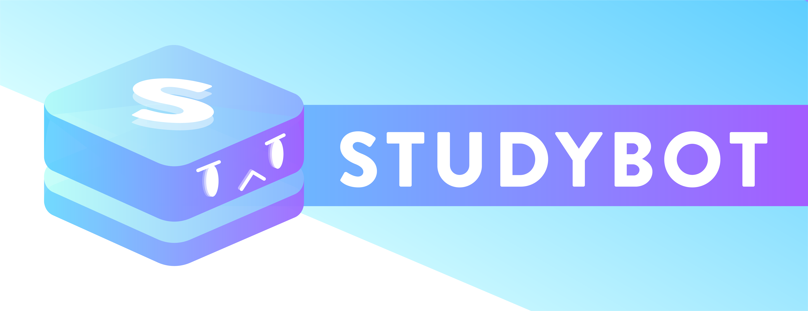

# StudyBot

StudyBot is a Discord bot which helps you get smarter!
It allows you to study from various question banks from all sorts of disciplines, and allows you to add your own too.
StudyBot is written in Python using `dis-snek`.
It uses MongoDB for persistence, and interfaces with Google Sheets API to read user-generated question banks.

# Adding/Updating Packages
If you are contributing, and would like to add a new library to the code, please make sure you add it to `requirements.in`. You will then need to update `requirements.txt`, following the below steps.

1. Ensure the `pip-tools` package is installed on your system. If not, install it with `pip install pip-tools`.
2. Update the `requirements.in` with the names of the new packages you want to add. (optional)
3. Run `pip-compile requirements.in > requirements.txt`, or run `pip-compile requirements.in` and copy the output to replace the contents of `requirements.txt`.

# Features
* Create your own set of questions to study off of on any platform which can access Google Sheets
* Practice your questions from the comfort of Discord
* Several different question types, ranging from multiple choice, flashcards, (coming soon) long answer & multi-part questions

### Basic Usage

### Adding Your Own Questions

# Timeline
2021 January: Start

2021 February: Basic implementation of quiz functionality through Google Sheets API for question storage

2021 March: Added support for images, performance improvements

2021 April: Bot is listed on top.gg, first public release

2021 May: Bot is officially verified by Discord

2021 June: Button implementation, major UI overhaul, and Airtable/explore page integration

2021 July: Sharding + more to come

2022 January: Full bot rewrite to support slash commands
